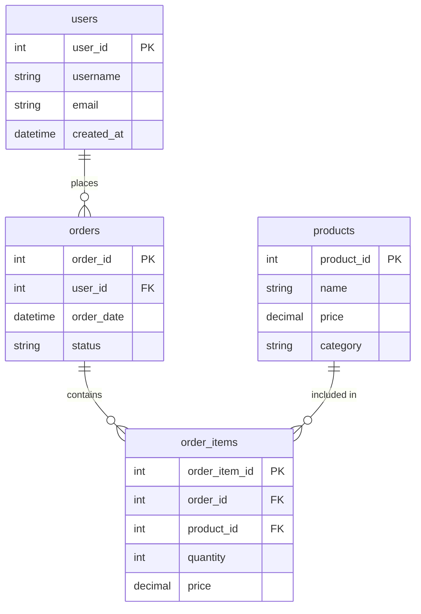

# SQL Query Editor & Visualizer 🚀

A powerful, modern SQL query editor and visualization tool built with React. This project focuses on creating an efficient, user-friendly SQL query execution and visualization platform with real-time data processing capabilities.

Live Link: [https://sqleditor.web.app](https://sqleditor.web.app)

## 📋 Project Overview

This application serves as a comprehensive SQL query execution environment, featuring real-time query processing, advanced data visualization, and intuitive table management. Built with performance and user experience in mind, it handles large datasets while maintaining smooth operation.

## 🚀 Getting Started

### Prerequisites
- Node.js (v16.0 or higher)
- npm (v8.0 or higher)

### Installation

1. Clone the repository
```bash
git clone https://github.com/ayushflows/a-random-one.git
cd a-random-one
```

2. Install dependencies
```bash
npm install
```

3. Start the development server
```bash
npm run dev
```

### Project Structure
```plaintext
sql-editor/
├── src/
│   ├── components/
│   │   ├── Editor/
│   │   ├── Results/
│   │   └── Schema/
│   ├── styles/
│   ├── assets/
│   │   └── data/
│   ├── utils/
│   └── services/
├── public/
└── package.json
```

### Available Scripts
- `npm run dev` - Start development server
- `npm run build` - Build for production
- `npm run preview` - Preview production build
- `npm run lint` - Run ESLint

### Browser Support
- Chrome (latest)
- Firefox (latest)
- Safari (latest)
- Edge (latest)

*Note: For the best experience, use modern browsers with latest JavaScript features support.*

## 🌟 Key Features

### Query Management & Execution
- **Multi-tab Environment**: Work with multiple queries simultaneously
- **Real-time Query Execution**: Powered by AlaSQL for instant results
- **Query History & Saved Queries**: Track and reuse previous queries
- **Partial Query Execution**: Run selected portions of queries
- **Syntax Error Detection**: Real-time error feedback using AlaSQL
- **Custom Font Controls**: Adjust editor font size and styling

### Data Management
- **Table Import/Export**: 
  - Import tables from CSV files
  - Export results in CSV or JSON formats
  - Handle large datasets efficiently
- **Table Customization**:
  - Add/modify columns and rows
  - Edit table structure through UI or queries
  - Real-time data modifications
  - Comprehensive table structure visualization

### Advanced Visualization
- **Smart Chart Detection**: Automatically suggests suitable visualization types based on data structure
- **Multiple Chart Types**:
  - Bar Charts: For categorical comparisons
  - Pie Charts: For distribution analysis
  - Scatter Plots: For correlation studies
- **Customizable Views**:
  - Adjustable chart dimensions
  - Fullscreen visualization mode
  - Interactive legends and tooltips
  - Theme-aware color schemes

### User Interface
- **Theme Support**: 
  - Light and Dark mode
  - Seamless theme switching
  - Consistent styling across components
- **Responsive Design**:
  - Adapts to all screen sizes
  - Mobile-friendly interface
  - Collapsible sidebars
- **Customizable Layout**:
  - Draggable section dividers
  - Adjustable panel sizes
  - Collapsible components

### Result Management
- **Advanced Pagination**:
  - Configurable rows per page (20-100)
  - Smooth page navigation
  - Row count indicators
- **Data Grid Features**:
  - Column sorting
  - Row numbering
  - Data type detection
  - NULL value handling

## 🛠️ Technical Stack

- **React 19**: Latest React features for optimal performance
- **Chart.js & react-chartjs-2**: Advanced data visualization
- **AlaSQL**: SQL query processing and validation
- **PapaParse**: CSV file handling
- **Lucide React**: Modern icon system
- **Firebase**: Hosting and deployment
- **Vite**: Fast development and optimized builds

## 💻 Performance Features

- Efficient handling of large datasets
- Optimized chart rendering
- Smooth transitions and animations
- Responsive data loading
- Cached query results
- Memory-efficient data processing

## 🎨 Design Philosophy

The interface is designed with data analysts in mind, focusing on:
- Clean, distraction-free workspace
- Intuitive navigation
- Quick access to frequently used features
- Customizable workspace layout
- Professional visualization options

## 🔄 Application Workflow

### User Journey
1. **Initial Experience**
   - Quick-loading interface (<2s load time)
   - Intuitive layout with clear navigation
   - Pre-loaded sample queries and data

2. **Query Development**
   - Write/paste SQL queries
   - Access saved queries
   - View query history
   - Real-time syntax validation

3. **Data Visualization**
   - Automatic chart suggestions
   - Interactive data exploration
   - Custom visualization settings
   - Export capabilities

### Data Flow
```plaintext
User Input → Query Validation → AlaSQL Processing → Result Generation → Visualization
```

## 📐 Architecture & Structure

### Component Architecture
```plaintext
App (Root)
├── NavBar
│   ├── ThemeToggle
│   └── Navigation
├── Editor Section
│   ├── QueryTabs
│   ├── QueryEditor
│   └── ControlPanel
├── Schema Section
│   ├── TableList
│   ├── TableStructure
│   └── DataManager
└── Result Section
    ├── TableView
    ├── ChartView
    └── ExportTools
```

## 🎯 Core Design Decisions

### User-Centric Approach
1. **Accessibility**
   - Keyboard shortcuts for common actions
   - Clear error messages
   - Responsive design for all devices

2. **Performance**
   - Optimized data loading
   - Efficient state management
   - Smart caching mechanisms

3. **Usability**
   - Intuitive UI/UX
   - Consistent behavior
   - Helpful feedback

### Feature Selection Rationale
- **Must-Have Features**: Based on core SQL development needs
  - Query execution
  - Data visualization
  - Table management

- **Value-Add Features**: Enhance user experience
  - Multiple visualization options
  - Custom layout controls
  - Advanced export options

## 📊 Performance Metrics

### Load Time Optimization
- Initial load: <2 seconds
- Subsequent loads: <1 second
- Query execution: Real-time

### Resource Usage
- Memory efficient data handling
- Optimized state updates
- Minimal re-renders

## 📚 Documentation & Resources

### Project Documentation
- [Architecture Diagram](link-to-architecture-diagram)
- [ER Diagram](link-to-er-diagram)
- [Detailed Documentation (PDF)](link-to-pdf)
- [Video Walkthrough](link-to-video)

### Development Decisions
- **Technology Choices**: Selected for performance and maintainability
- **Code Structure**: Organized for scalability and readability
- **Feature Implementation**: Balanced functionality with complexity

## 🔍 Testing & Quality Assurance

### Performance Testing
- Load testing with large datasets
- Response time monitoring
- Memory usage tracking

### User Testing
- Interface usability
- Feature accessibility
- Error handling

## 🚀 Future Enhancements

### Planned Features
1. **Query Optimization**
   - Execution plan visualization
   - Performance suggestions
   - Query templates

2. **Advanced Analytics**
   - Custom chart builders
   - Data trend analysis
   - Export customization

3. **Collaboration Features**
   - Query sharing
   - Result sharing
   - Multi-user support

## 👨‍💻 Author

Ayush Tripathi
- GitHub: [github.com/ayushflows](https://github.com/ayushflows)
- LinkedIn: [linkedin.com/in/ayushflows](https://linkedin.com/in/ayushflows)

## 📊 Database Schema

### Predefined Table Sets
The application currently works with four predefined tables that demonstrate common database relationships and real-world scenarios:



### Table Relationships
- **users → orders**: One-to-Many (A user can place multiple orders)
- **orders → order_items**: One-to-Many (An order can contain multiple items)
- **products → order_items**: One-to-Many (A product can be part of multiple order items)

### Sample Queries
Users can practice with these tables using various SQL operations:
- JOIN operations across multiple tables
- Aggregate functions on order data
- Complex filtering and grouping
- Data analysis and reporting queries

### Data Import/Export
- Import additional data through CSV files
- Modify existing table structures
- Export query results in CSV/JSON formats
- Maintain data relationships while performing operations

*Note: While these are the current predefined tables, the application's architecture supports adding more tables through CSV imports.*

---

